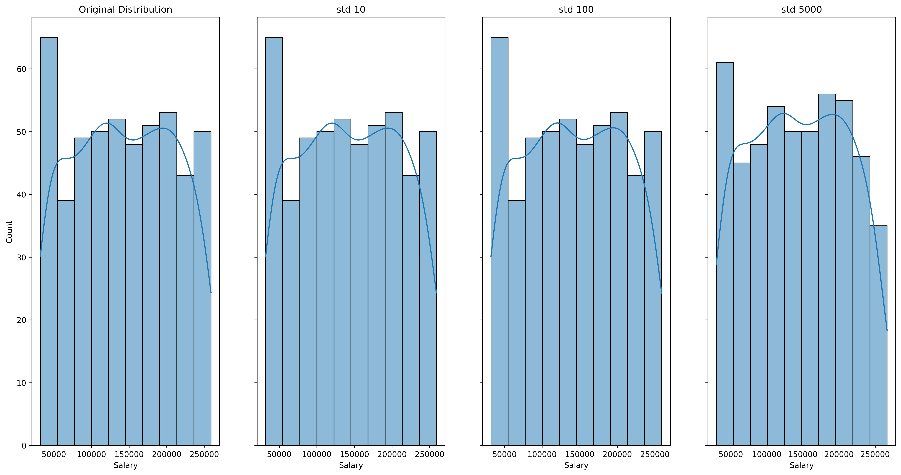

::::::::::::::::::::::::::::::::::::::: objectives

- How can we add random noise to data.
- What are the effects of adding noise to data.

::::::::::::::::::::::::::::::::::::::::::::::::::

:::::::::::::::::::::::::::::::::::::::: questions

- What is the limit of noise that can be added to data?
- Can you still identify the original data with noise added?

::::::::::::::::::::::::::::::::::::::::::::::::::

## Pertubation Numeric Data.

Adding noise to a data column is the process of changing the values of a column, but keeping the overall distribution. Important here is that noise needs to be added to numerical data.

As before, we will start with the dataset given in lesson [Terminology](01-terminology.md):

```output

    Surname     First Name    Gender     Age     \
0   Matheson    Alison        Female     39
1   McPherson   Caitlin       Female     19
2   Robb        Victoria      Female     31
3   Matthews    Debbie        Female     51
4   Wallace     Susan         Female     67


    Party Choice   Postcode    Email                    \
0   NZ First       6418        thomas76@yahoo.com	   
1   National       8213        anthonydavies@pritchard-barnett.maori.nz
2   ACT            8869        hunter97@gmail.com	  
3   ACT            9785        laurensonpeter@xtra.co.nz 
4   NZ First       8686        matthew87@hope-smith.ac.nz	


    Job Title                       Company                       Salary
0   Quantity surveyor               Barnes LLC                    40000
1   Illustrator                     Cook, Pratt and Peters        175000
2   Banker                          McDonald, Thompson and Kelly  195000
3   Mining engineer                 Freeman-Barnett               254000
4   Industrial/product designer     Cresswell-Smith               225000
```

The above dataset has two quasi-identifiable columns that we can use aggregation on.

:::::::::::::::::::::::::::::::::::::::  challenge

## Which Data to Pertubate

In the above dataset, which columns would you generally add noise to?

:::::::::::::::  solution

## Solution

- Salary

:::::::::::::::::::::::::

:::::::::::::::::::::::::::::::::::::::::::::::::

Adding noise (Perturbation) is generally done using a normal distribution. A standard deviation is specified which tells the `random.normal()` method how far off the center of the normal (the actual number) the number should be:

```python
def add_noise(df, column, std=10):
    copy_df = df.copy(deep=True)
    copy_df[column] = copy_df[column].add(np.random.normal(0, std, df.shape[0]))

    return copy_df
```

Running the code transforms the original number using a normal distribution with a specified standard deviation. The following is the output of the above data snippet:

```output

   Surname     First Name   Gender    Age      \
0  Matheson    Alison       Female    39
1  McPherson   Caitlin      Female    19
2  Robb        Victoria     Female    31
3  Matthews    Debbie       Female    51
4  Wallace     Susan        Female    67


   Party Choice  Postcode    Email                 \
0  NZ First      6418        thomas76@yahoo.com
1  National      8213        anthonydavies@pritchard-barnett.maori.nz
2  ACT           8869        hunter97@gmail.com
3  ACT           9785        laurensonpeter@xtra.co.nz
4  NZ First      8686        matthew87@hope-smith.ac.nz 


   Job Title                     Company                        Salary
0  Quantity surveyor             Barnes LLC                     39911.075261
1  Illustrator                   Cook, Pratt and Peters         174901.557924
2  Banker                        McDonald, Thompson and Kelly   195037.198805
3  Mining engineer               Freeman-Barnett                253996.409939
4  Industrial/product designer   Cresswell-Smith                225007.010926
```

As we can see, this code generates a column with slightly different data. For reference, here is the unaltered, Perturbation, and Aggregate Salary column next to each other:

```output

   Unaltered Salary         Pertubation Salary           Aggregate Salary
0  40000                    39911.075261                 31-50K
1  175000                   174901.557924                101-250K
2  195000                   195037.198805                101-250K
3  254000                   253996.409939                250K+
4  225000                   225007.010926                101-250K
```

:::::::::::::::::::::::::::::::::::::::  challenge

## Appropriate Use of Pertubation

In the above 3 column comparison, which column makes it harder to determine what the original data was?

:::::::::::::::  solution

## Solution

- Upon inspection, aggregation is much better at anonymising the original data when compared to perturbation.

:::::::::::::::::::::::::

:::::::::::::::::::::::::::::::::::::::::::::::::

## When is pertubation a good technique to use and what to be careful about

The important thing about Perturbation is that you do not loose the utility of the data as a whole. What is meant by this is that the original data might follow a certain distribution, and adding noise to that data will retain that distribution. This is important for certain analysis in which aggregating the data would not be as useful. 

Caution must be exercised here, because specifying too high of a standard deviation in the `random.normal()` method will change the distribution. The following image shows the effect of increased standard deviation on the distribution of data in the Salary column.

{alt='Effect of STD on the distribution of data'}

As the image shows, a larger standard deviation will end up changing the orginal distribution of the data. Because of this, care must be taken when specifying the standard deviation. Important here as well is that the original data distribution is preserved even if the actual numbers are different.

:::::::::::::::::::::::::::::::::::::::: keypoints

- Perturbation is not necessarily the best method to anonymise numerical data.
- Perturbation is important to use when the distribution of the original data is important.

::::::::::::::::::::::::::::::::::::::::::::::::::
